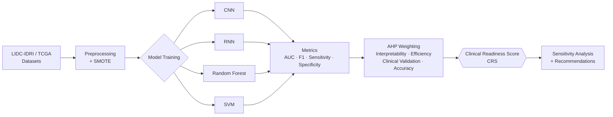

<!--
  ╔══════════════════════════════════════════════════════════════════════════╗
  ║                       SHIVA JYOTI — GITHUB PROFILE                       ║
  ║   ML Researcher · Full-Stack Engineer · Cloud Architect · Data Analyst   ║
  ║                       Theme: Tokyo Night (consistent)                    ║
  ╚══════════════════════════════════════════════════════════════════════════╝
-->

<!-- ╔═══════════════════════ SECTION 1 — HERO HEADER ═══════════════════════╗ -->

  

  

  
  
  

  
  
  
  
  
  

 

<!-- ╔═══════════════════════ SECTION 2 — ABOUT ME ═══════════════════════╗ -->

## <picture></picture> About Me

I'm a **third-year B.Tech Computer Science (Data Science)** student at **VIT Chennai** (CGPA **9.23/10**), where research and engineering meet on my keyboard every day. My world sits at the intersection of **machine learning research**, **full-stack engineering**, and **cloud-native systems** — I publish papers *and* ship production code.

I authored a **Springer peer-reviewed paper** on AI-driven lung cancer prognosis (ICT4SD 2025), where I designed the **Clinical Readiness Score (CRS)** — a novel evaluation framework using the **Analytic Hierarchy Process (AHP)** to weigh interpretability, efficiency, clinical validation, and accuracy across CNNs, RNNs, RF, and SVMs on the LIDC-IDRI and TCGA datasets.

When I'm not in research mode, I architect **AI-powered systems** like LifeMemory AI (RAG + LangGraph + pgvector) and **cloud-native platforms** on AWS — and lead operations as **Financial Lead at ACM-W VIT**, having run 4 hackathons for 250–300+ participants each.

- 🔬 **Currently:** building **LifeMemory AI** — a privacy-first journal with multi-step LangGraph reasoning
- 🌱 **Learning:** advanced distributed systems, retrieval-augmented architectures, MLOps
- 🎯 **Open to:** research collaborations, ML/SWE internships, open-source contributions
- 💬 **Ask me about:** RAG pipelines, AHP-based evaluation, AWS 3-tier architectures, pgvector
- ⚡ **Fun fact:** I once analyzed **~4.8M UIDAI records** and turned them into actionable district-level policy insights

 

`🔬 Research` ・ `⚡ Engineering` ・ `☁️ Cloud` ・ `📊 Data Science` ・ `🧠 LLM Systems`

 

---

<!-- ╔═══════════════════════ SECTION 3 — GITHUB STATS ═══════════════════════╗ -->

## <picture></picture> GitHub Activity Stats

  
  

 

  

 

  

 

  

 

  
  

 

---

<!-- ╔═══════════════════════ SECTION 4 — TECH STACK ═══════════════════════╗ -->

## <picture></picture> Tech Stack

<b>💻 Languages</b>

 

  
  
  
  
  
  
  

<b>🌐 Frontend & Backend</b>

 

  
  
  
  
  
  
  
  
  
  
  

<b>🧠 AI / ML / Data</b>

 

  
  
  
  
  
  
  

<b>🗄️ Databases</b>

 

  
  
  
  
  

<b>☁️ Cloud & DevOps</b>

 

  
  
  
  
  
  
  
  

<b>🛠️ Tools & Platforms</b>

 

  
  
  
  
  
  

<b>📚 Core Concepts</b>

 

  
  
  
  
  
  
  

 

---

<!-- ╔═══════════════════════ SECTION 5 — FEATURED PROJECTS ═══════════════════════╗ -->

## <picture></picture> Featured Projects

> Four projects spanning **AI-powered systems**, **cloud-native platforms**, and **data-science research at scale**.

 

### 🧠 LifeMemory AI — AI-Powered Personal Memory System

  
  
  
  
  
  
  

A **privacy-first journaling platform** that uses Retrieval-Augmented Generation to help users explore their own memories like a conversation with their past self.

- 🧬 **RAG pipeline** combining semantic search, metadata filtering, and **temporal prioritization**
- 🕸️ **Multi-step LangGraph reasoning** — intent classification → retrieval → synthesis
- ⚡ **Async FastAPI backend** with PostgreSQL + **pgvector** for vector similarity at scale
- 🔐 **JWT + Supabase Auth + Row-Level Security (RLS)** — privacy by design, not afterthought
- 🐳 **Docker-deployed** with structured logging and monitoring

  
  

 

### 📚 BookShelf — Social AI-Powered Book Platform

  
  
  
  
  
  
  
  

A **full-stack social book platform** with hybrid AI recommendations and real-time community features.

- 🎯 **Hybrid recommendation engine** built on PostgreSQL + **pgvector** (content + collaborative)
- 💬 **Real-time chat** via WebSockets — book clubs that actually talk
- 📖 **Open Library API integration** for a dynamic, ever-growing catalog
- 🔐 **JWT auth via Supabase** with secure token refresh
- 🧱 **Zustand state management** + **Axios interceptors** for clean, resilient client-server contracts

  <!-- TODO: replace with the real BookShelf repo URL when published -->
  
  

 

### ☁️ CloudCollab — Cloud-Native Real-Time Collaborative Coding Platform

  
  
  
  
  
  
  
  
  
  

A **3-tier AWS-native** real-time pair-programming platform with live video and multi-language code execution.

- 🏛️ **3-tier AWS architecture** — S3 (static) + CloudFront (CDN) + Elastic Beanstalk (compute)
- 🗃️ **DynamoDB with GSI/LSI** indexing for high-throughput, low-latency reads
- 🎥 **WebRTC video conferencing** + collaborative code editor with operational transforms
- 🔐 **JWT + Role-Based Access Control (RBAC)** — owner / editor / viewer permissions
- 🌍 **Multi-language code execution** via secure external sandbox APIs
- 📈 **AWS CloudWatch** monitoring with custom metrics and alarms

  <!-- TODO: replace with the real CloudCollab repo URL when published -->
  
  

 

### 📊 UIDAI Service Stress Zone Analysis

  
  
  
  
  

District-level **stress-zone analytics** on **~4.8M Aadhaar enrolment + update records** with a custom metric and policy framework.

- 📦 Cleaned and analyzed **~4.8M records** across enrolment + update datasets
- 🧮 Designed a novel **Service Stress Ratio** metric for district-level diagnosis
- 📈 Performed **univariate, bivariate, and trivariate** statistical analysis
- 🌲 **Random Forest** classifier for stress-level categorization
- 🏛️ Built a **policy recommendation framework** for resource allocation
- 🔁 **Trend & persistence analysis** — separating systemic issues from transient spikes

  
  

 

---

<!-- ╔═══════════════════════ SECTION 6 — RESEARCH ═══════════════════════╗ -->

## <picture></picture> Research & Publications

<table>
  <tr>
    <td width="120" align="center">
      
    </td>
    <td>
      <b>📝 Improving Lung Cancer Prognosis Through Data Science</b> 
      <i>Shiva Jyoti, Samriddhi Ganguly, B. Sri Soumya, S. Nachiyappan</i> 
      <b>ICT4SD 2025</b> · Lecture Notes in Networks and Systems, vol. 1652 · Springer, Cham · <b>Oct 31, 2025</b> 
      <code>DOI: 10.1007/978-3-032-06691-6_9</code>
    </td>
  </tr>
</table>

This work introduces the **Clinical Readiness Score (CRS)** — a structured, multi-criteria evaluation metric for AI models in lung cancer diagnosis. CRS combines **interpretability, efficiency, clinical validation, and accuracy**, with weights assigned via the **Analytic Hierarchy Process (AHP)** and validated for consistency. We benchmarked **CNNs, RNNs, Random Forest, and SVM** on the **LIDC-IDRI** and **TCGA** datasets, evaluating **AUC, F1-score, sensitivity, and specificity**, and provide AHP weight distributions, sensitivity analysis, and CRS factor contributions to support clinical adoption.

<b>📐 Methodology Flow</b>

  
  

 

---

<!-- ╔═══════════════════════ SECTION 7 — CODING PROFILES ═══════════════════════╗ -->

## <picture></picture> Coding Profiles

  

 

  
  
  
  

 

---

<!-- ╔═══════════════════════ SECTION 8 — EDUCATION ═══════════════════════╗ -->

## <picture></picture> Education Timeline

<table>
  <thead>
    <tr>
      <th align="center">📅 Year</th>
      <th align="left">🏫 Institution</th>
      <th align="left">🎓 Degree / Board</th>
      <th align="center">📊 Score</th>
    </tr>
  </thead>
  <tbody>
    <tr>
      <td align="center"><b>2023 – Present</b></td>
      <td><b>Vellore Institute of Technology, Chennai</b></td>
      <td>B.Tech, Computer Science (Data Science)</td>
      <td align="center"></td>
    </tr>
    <tr>
      <td align="center"><b>2022</b></td>
      <td>Pratap World School</td>
      <td>CBSE — Class XII</td>
      <td align="center"></td>
    </tr>
    <tr>
      <td align="center"><b>2020</b></td>
      <td>Indian Heritage School</td>
      <td>ICSE — Class X</td>
      <td align="center"></td>
    </tr>
  </tbody>
</table>

 

---

<!-- ╔═══════════════════════ SECTION 9 — LEADERSHIP ═══════════════════════╗ -->

## <picture></picture> Leadership & Activities

<table>
  <tr>
    <td width="140" align="center">
        
        
      <code>Jul 2025 – Present</code>
    </td>
    <td>
      <b>Financial Lead — ACM-W, VIT Chennai</b>
      <ul>
        <li>🏆 Led <b>4 large-scale hackathons</b>, each with <b>250–300+ participants</b></li>
        <li>💰 Owned end-to-end <b>budget &amp; operations</b> for events serving <b>400+ participants</b></li>
        <li>🤝 Coordinated with <b>sponsors</b> and cross-functional student teams</li>
        <li>📊 Built financial trackers and post-event reports for transparency &amp; audit</li>
        <li>🌐 Strengthened the <b>women-in-computing</b> community at VIT through inclusive programming</li>
      </ul>
    </td>
  </tr>
</table>

 

| 🏆 Hackathons Led | 👥 Participants Served | 💼 Sponsor Partnerships | 📅 Tenure |
| :---: | :---: | :---: | :---: |
| **4** | **400+** | **Multiple** | **Active** |

 

---

<!-- ╔═══════════════════════ SECTION 10 — CONTRIBUTION SNAKE ═══════════════════════╗ -->

## <picture></picture> Contribution Snake

  <picture>
    <source media="(prefers-color-scheme: dark)" srcset="https://raw.githubusercontent.com/Shiva210Jyoti/Shiva210Jyoti/output/github-contribution-grid-snake-dark.svg" />
    <source media="(prefers-color-scheme: light)" srcset="https://raw.githubusercontent.com/Shiva210Jyoti/Shiva210Jyoti/output/github-contribution-grid-snake.svg" />
    
  </picture>

 

> 🔁 The snake auto-regenerates daily and on every push via the GitHub Actions workflow at [`.github/workflows/snake.yml`](.github/workflows/snake.yml).

 

---

<!-- ╔═══════════════════════ SECTION 11 — FOOTER ═══════════════════════╗ -->

## <picture></picture> Thanks for visiting!

<i>"Build with research-grade rigor. Ship with engineering speed."</i>

 

  

  

<!-- ╚══════════════════════════════════════════════════════════════════════════╝ -->
